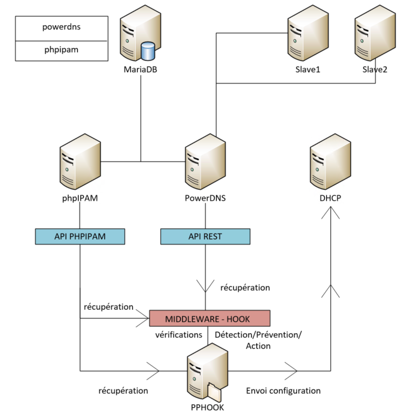

# PPHOOK - phpIPAM/PowerDNS Hook - Integration Middleware


**Author:** Intern n°38  

## Table of Contents

- [Overview](#overview)
- [Features](#features)
- [Architecture](#architecture)
- [Prerequisites](#prerequisites)
- [Installation](#installation)
- [Configuration](#configuration)
- [Usage](#usage)
- [API Documentation](#api-documentation)
- [Monitoring](#monitoring)
- [Security](#security)
- [Changelog](#changelog)
- [Support](#support)
- [License](#license)

## Overview

PPHOOK is an enterprise-grade middleware solution designed to ensure data integrity and seamless synchronization between phpIPAM (IP Address Management) and PowerDNS systems. This solution acts as an intelligent bridge that validates, synchronizes, and corrects DNS records automatically, preventing configuration errors that could affect network services.

### Problem Statement

Organizations managing large IP infrastructures often face DNS inconsistencies between their IPAM system and DNS servers. Manual synchronization leads to:

- Orphaned DNS records (A records without corresponding PTR records)
- Hostname duplications across different IP addresses
- MAC address conflicts in DHCP reservations
- Zone validation failures causing network resolution issues

### Solution

PPHOOK implements a real-time synchronization engine that automatically maintains DNS consistency across your infrastructure.

## Features

### Core Functionality
- **Real-time DNS Validation**: Validates hostnames and IP addresses according to DNS standards (RFC 1035)
- **A/PTR Record Consistency**: Ensures forward and reverse DNS records are always synchronized
- **Automatic Error Correction**: Detects and removes orphaned or inconsistent DNS records
- **Zone Compliance Validation**: Validates hostnames against existing DNS zones
- **Duplicate Detection**: Identifies and resolves hostname and MAC address conflicts

### Operational Features
- **Email Notifications**: Sends detailed alerts to administrators when issues are detected
- **Complete Audit Trail**: Comprehensive logging of all operations for compliance and troubleshooting
- **Periodic Synchronization**: Regular checks to maintain consistency between systems
- **Configuration Management**: Centralized configuration with encrypted storage
- **Service Integration**: Generates DHCP reservations and DNS zone configurations

## Architecture



## Prerequisites

- **OS**: Debian 11+ or Ubuntu 20.04+
- **RAM**: 4GB minimum
- **Python**: 3.8+
- **Database**: MariaDB/MySQL 5.7+
- **Access**: Root/sudo required

For complete details, see the [DAT](doc/DAT.md).

## Installation

### Quick Start

1. **Clone the repository**
   ```bash
   git clone < lien https git >
   cd pphook
   ```

2. **Configure global variables**
   ```bash
   cp global_vars.sh global_vars.sh.bkp
   nano global_vars.sh
   cd bash/
   source create_env.sh
   ```

3. **Run installation scripts**
   ```bash
   cd main_scripts/
   
   # Install PPHOOK
   source hook.sh
   ```

4. **Verify installation**
   ```bash
   systemctl status pphook
   tail -f /var/log/pphook.log
   
   # Verify log rotation setup
   cat /etc/logrotate.d/pphook
   ```
   
## Configuration

### Global Variables

The main configuration is managed through `global_vars.sh`.

### Security Configuration

All sensitive configuration is encrypted using GPG:

```bash
# Configuration is automatically encrypted during installation
ls -la .env.gpg .gpg_passphrase

# Manual encryption/decryption
gpg --symmetric --cipher-algo AES256 --output .env.gpg .env
gpg --decrypt .env.gpg
```

## Usage

### Service Management

```bash
# Start/stop PPHOOK service
systemctl start pphook
systemctl stop pphook
systemctl restart pphook

# Check service status
systemctl status pphook

# View logs
tail -f /var/log/pphook.log
journalctl -u pphook -f
```

### Manual Execution

```bash
# Run single synchronization cycle
cd /opt/pphook
python3 hook.py

# Run with debug output
python3 hook.py --debug
```

### Configuration Management

```bash
# Generate DHCP reservations
cd python/
python3 dhcpd_conf_gen.py

# Generate DNS zone configurations
python3 bind_local_gen.py

# Push configurations to servers
cd ../bash/
./dhcp_conf_push.sh
./dns_conf_push.sh

OR use CRON
```

## API Documentation

### Connectivity Test
```bash
#phpIPAM
curl http://ipam.domain.local/api/pphook/sections/

#PowerDNS
curl -H "X-API-Key: API_KEY" http://dns.domain.local:8081/api/v1/servers
```

## Monitoring

### Health Checks

```bash
# Service health
systemctl is-active pphook

# API connectivity
curl -s -H "X-API-Key: $PDNS_API_KEY" http://localhost:8081/api/v1/servers
curl -s http://localhost/api/pphook/sections/

# Database connectivity
mysql -u pdns_user -p -h db_server -e "SELECT 1"
```

### Log Monitoring

```bash
# Real-time log monitoring
tail -f /var/log/pphook.log

# Error detection
grep ERROR /var/log/pphook.log

# Performance metrics
grep "Traitement terminé" /var/log/pphook.log
```

### Log Rotation

Automatic log rotation is configured during installation:

```bash
# Log rotation configuration
cat /etc/logrotate.d/pphook

# Manual rotation test
sudo /usr/sbin/logrotate -f /etc/logrotate.d/pphook

# View rotated logs
ls -la /var/log/pphook*
```

### Log retention:

- Daily rotation with 30 days retention
- Automatic compression (.gz)
- Force rotation if log > 100MB

## Security

For security-related information, vulnerability reporting, and security best practices, please see our [Security Policy](SECURITY.md).

## Changelog

### Version 1.0
- Initial release

## Support

- **Documentation**: [DAT complet](doc/DAT.md)
- **Issues**: GitHub Issues for bugs and requests
- **Logs**: `tail -f /var/log/pphook.log`

To report a bug, include :
- Version PPHOOK
- OS and version
- Complete error logs

**Log Management:**
- Logs automatically rotated daily
- 30 days retention policy
- Compressed archives in `/var/log/pphook*.gz`

## License

This project is licensed under the GNU General Public License v3.0 - see the [LICENSE](LICENSE) file for details.

### GPL v3.0 Summary

You are free to:
- Use the software for any purpose
- Change the software to suit your needs
- Share the software with your friends and neighbors
- Share the changes you make

Under the conditions:
- Source code must be made available when software is distributed
- A copy of the license and copyright notice must be included
- Changes made to the code must be documented

---

**Project Repository**: [https://github.com/lecoqal/pphook](https://github.com/lecoqal/pphook)  
**Documentation**: [Technical Architecture Document](doc/DAT.md)
