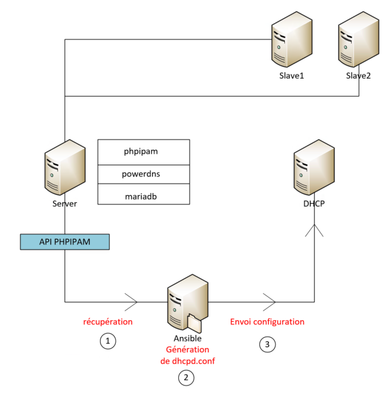
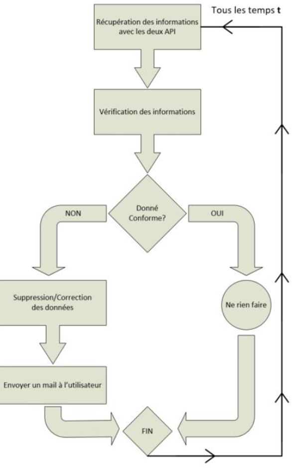

# PPHOOK DAT - Technical Architecture Document

**Version:** 1.0  
**Date:** January 2025  
**Author:** Intern #38  
**Project:** PPHOOK - phpIPAM/PowerDNS Hook - Integration Middleware


---

## Table of Contents

1. [Project Overview](#1-project-overview)
2. [Existing System Analysis](#2-existing-system-analysis)
3. [General Architecture](#3-general-architecture)
4. [Detailed Technical Architecture](#4-detailed-technical-architecture)
5. [Network and Security Architecture](#5-network-and-security-architecture)
6. [Business Processes and Algorithms](#6-business-processes-and-algorithms)
7. [User Interface and Monitoring](#7-user-interface-and-monitoring)
8. [Deployment and Operations](#8-deployment-and-operations)
9. [Performance and Scalability](#9-performance-and-scalability)

---

## 1. Project Overview

### 1.1 Context and challenges

This project is part of a phpIPAM/PowerDNS integration infrastructure, where phpIPAM manages the network's IP address inventory and PowerDNS serves as the network's master DNS server. When entering information into phpIPAM, there is no verification performed on the consistency and validity of entries.

This lack of control generates numerous operational issues that directly impact network service quality and administration team productivity.

**Identified issues:**
- **DNS inconsistencies**: Orphaned DNS records (A records without corresponding PTR records) creating resolution malfunctions
- **Critical duplicates**: Duplicate MAC addresses in DHCP reservations causing network conflicts
- **Naming conflicts**: Identical hostnames on different IP addresses generating confusion
- **Insufficient validation**: Lack of DNS zone validation when creating entries
- **Manual processes**: Time-consuming manual synchronization prone to human errors
- **Missing audit**: No traceability of modifications and corrections performed

**Business challenges:**
- Improvement of network service reliability
- Reduction of technical team intervention time
- Minimization of service interruptions related to DNS errors
- Standardization of IP address management processes

### 1.2 Project objectives

**Main objective:** Develop a software solution that allows verification, correction, and alerting users about errors entered in phpIPAM, while ensuring automatic synchronization with PowerDNS.

**Specific objectives:**
- **Automatic validation**: Control data consistency according to DNS standards (RFC 1035)
- **Intelligent synchronization**: Automate bidirectional synchronization between phpIPAM and PowerDNS
- **Proactive detection**: Automatically identify MAC and hostname duplicates before they cause malfunctions
- **Automatic correction**: Automatically resolve conflicts according to predefined business rules
- **Targeted notification**: Alert responsible users about errors with precise information for correction
- **Complete audit**: Maintain detailed history of all operations for compliance and diagnosis
- **Automatic generation**: Automatically produce DHCP and DNS configurations from validated data

### 1.3 Functional scope

**Included scope:**

*Main features:*
- **Real-time synchronization**: Automatic processing of phpIPAM modifications to PowerDNS
- **Complete DNS validation**: RFC 1035 compliance verification and zone consistency
- **Duplicate management**: Detection and automatic resolution of MAC/hostname conflicts
- **Notification system**: Personalized email alerts with dynamic templates
- **Configuration generation**: Automatic production of DHCP and BIND files
- **AXFR monitoring**: Real-time monitoring of DNS zone transfers
- **Anti-overload protection**: Processing limitation to avoid system impacts
- **Audit trail**: Complete traceability of operations and modifications

*Processed data:*
- IP addresses and hostnames
- MAC addresses and DHCP profiles
- DNS records (A, PTR)
- DNS zones and configurations
- User information and changelog

**Excluded scope:**
- Direct modification of active network configurations
- User and permission management for phpIPAM/PowerDNS
- Database backup and restoration
- Dedicated web graphical interface (using logs and system monitoring)
- SSL/TLS certificate management
- Initial DNS zone configuration (must be preliminary)

### 1.4 Constraints and assumptions

**Technical constraints:**
- **Software compatibility**: phpIPAM 1.7+ and PowerDNS 4.7+ minimum required
- **System environment**: Deployment exclusively on Debian 11+ / Ubuntu 20.04+
- **Hardware resources**: Minimum 4GB RAM and 10GB disk space for PPHOOK server
- **Network connectivity**: HTTP/HTTPS access to phpIPAM and PowerDNS APIs required
- **Database**: MySQL/MariaDB 5.7+ with concurrent access to phpIPAM and PowerDNS databases
- **Security**: GPG encryption of configurations and secure credential management
- **Performance**: Maximum processing time of 60 seconds per synchronization cycle

**Operational constraints:**
- **Availability**: 24/7 service with tolerance for temporary API failures
- **Notifications**: SMTP server accessible for alert sending
- **Maintenance**: Maintenance windows coordinated with dependent services
- **Audit**: Log retention for minimum 6 months for compliance

**Operating assumptions:**
- **Operational services**: phpIPAM and PowerDNS functional and properly configured
- **Accessible APIs**: REST endpoints available with valid authentication
- **Existing DNS zones**: Forward and reverse zones previously created in PowerDNS
- **Configured users**: phpIPAM user accounts with valid email addresses
- **Stable network**: Reliable network connectivity between all components
- **Initial data**: phpIPAM database containing consistent data at startup

**Business assumptions:**
- **Resolution rules**: In case of duplicates, keep the oldest entry
- **Accepted notifications**: Users accept receiving automatic alerts
- **Defined DNS zones**: Known and stable managed DNS zone scope
- **DHCP profiles**: Use of "infra" and "lise" profiles for reservations

---

## 2. Existing System Analysis

### 2.1 Current infrastructure

**Existing components:**
- phpIPAM: Centralized IP address management and network inventory
- PowerDNS: Authoritative DNS server with REST API
- BIND9 servers: Slave DNS servers for distribution
- DHCP server: Automatic IP address distribution
- MySQL/MariaDB database: Storage for phpIPAM and PowerDNS data



### 2.2 Identified issues

**DNS inconsistencies:**
- A records without corresponding PTR records
- IP addresses in phpIPAM without DNS records
- Orphaned DNS records after deletion in phpIPAM
- Unvalidated DNS zones when creating entries

**Duplicates and conflicts:**
- Duplicate MAC addresses in DHCP reservations
- Identical hostnames on different IP addresses
- Name conflicts during configuration generation

**Manual processes:**
- Manual synchronization between phpIPAM and PowerDNS
- Manual DHCP configuration generation
- Manual data consistency verification
- Manual conflict resolution

### 2.3 Considered solutions

**Option 1: In-between Script**
- Advantages: Total control
- Disadvantages: Loss of native PowerDNS > phpIPAM integration

**Option 2: Real-time middleware (chosen solution)**
- Advantages: Continuous synchronization, automatic validation, notifications
- Disadvantages: Higher complexity, maintenance

**Option 3: Direct integration into phpIPAM**
- Advantages: Native integration
- Disadvantages: Source code modification, dependency on updates

### 2.4 Justification of chosen approach

The middleware approach was chosen for its advantages:
- **Independence**: No modification of existing systems
- **Flexibility**: Possibility of adaptation to evolutions
- **Maintainability**: Centralized and specialized code
- **Monitoring**: Dedicated process monitoring
- **Evolutivity**: Easy addition of new features

---

## 3. General Architecture

### 3.1 System overview

PPHOOK acts as an intelligent middleware between phpIPAM and PowerDNS, ensuring DNS data consistency and automatic generation of network configurations.



### 3.2 Main components

**PPHOOK Core:**
- **hook.py**: Main orchestrator and business logic
- **phpipam.py**: phpIPAM API interface
- **pdns.py**: PowerDNS API interface
- **System service**: Continuous synchronization daemon

**Utility modules:**
- **dhcpd_conf_gen.py**: DHCP configuration generation
- **bind_local_gen.py**: BIND configuration generation
- **Monitoring scripts**: AXFR and system health monitoring

**Infrastructure:**
- **Database**: MySQL/MariaDB for phpIPAM and PowerDNS
- **Encrypted configuration**: Secure credential storage
- **Centralized logging**: Complete audit trail

### 3.3 Data flow

**Main synchronization flow:**
1. Retrieve modifications from phpIPAM
2. Data validation (IP, hostname, DNS zones)
3. Duplicate detection and resolution
4. Synchronization with PowerDNS
5. DHCP/DNS configuration generation
6. Administrator notification

**Bidirectional data flow:**
- phpIPAM → PPHOOK → PowerDNS (creation/modification)
- PowerDNS → PPHOOK → phpIPAM (validation/cleanup)

### 3.4 Interfaces and integrations

**Used APIs:**
- phpIPAM REST API: Address and changelog retrieval
- PowerDNS API: DNS record management
- SMTP: Email notifications
- File system: Generated configurations

**Network protocols:**
- HTTP for APIs
- SMTP for notifications
- DNS (TCP/UDP 53) for validation

---

## 4. Detailed Technical Architecture

### 4.1 PPHOOK Component (Middleware)

**Modular structure:**

```
/opt/pphook/
├── hook.py              # Main orchestrator
├── phpipam.py           # phpIPAM API module
├── pdns.py              # PowerDNS API module
├── config.ini           # System configuration
├── templates/           # Email and config templates
├── pphook_venv/         # Python virtual environment
```

**hook.py functionalities:**
- Orchestration of synchronization processes
- Timestamp management and protection against massive processing
- Data validation according to RFC 1035
- Error handling and notifications
- Complete audit trail

**PhpIPAMAPI class:**
- Authentication and token management
- Modified address retrieval
- MAC and hostname duplicate detection
- Changelog and user management

**PowerDNSAPI class:**
- DNS A and PTR record management
- DNS zone validation
- Orphaned record cleanup
- Optimizations with DNS cache

### 4.2 phpIPAM integration

**phpIPAM REST API:**
- Endpoint: `/api/{app_id}/addresses/`
- Authentication: Token-based
- Filtering by modification date
- Address changelog retrieval

**Processed data:**
- IP addresses and hostnames
- MAC addresses and DHCP profiles
- Modification timestamps
- User information

**Duplicate management:**
- MAC duplicate detection algorithm
- Hostname conflict resolution
- Keep oldest address
- User notification

### 4.3 PowerDNS integration

**PowerDNS REST API:**
- Endpoint: `/api/v1/servers/{server}/zones/`
- Authentication: API Key
- A and PTR record management
- DNS zone validation

**DNS operations:**
- A record creation/modification
- PTR record management (reverse DNS)
- A ↔ PTR consistency validation
- Orphaned record cleanup

**Optimizations:**
- DNS zone cache (1-hour TTL)
- Persistent HTTP sessions
- Automatic retry on error
- Local validation before API querying

### 4.4 Database

**Used databases:**
- `phpipam`: IP address storage and inventory
- `powerdns`: DNS records and zones
- `pdnsadmin`: PowerDNS administration interface (optional)

**Users and permissions:**
- `ipam_user`: Read/write access to phpIPAM and read access to PowerDNS
- `pdns_user`: Full access to PowerDNS database
- `pdnsadmin_user`: Administration interface access

**Optimizations:**
- Index on frequently searched columns
- Optimized TCP connections
- Timeout and reconnection management

---

## 5. Network and Security Architecture

### 5.1 Network topology

[NETWORK TOPOLOGY DIAGRAM]

**Main servers:**
- PPHOOK server: [information to complete - management IP]
- phpIPAM server: [information to complete - management IP]
- PowerDNS server: [information to complete - management IP]
- Database server: [information to complete - management IP]
- Slave DNS servers: [information to complete - NS01 and NS02 IPs]

### 5.2 Network flows and ports

**Used ports:**
- TCP 80/443: phpIPAM API
- TCP 8081: PowerDNS API
- TCP 3306: MySQL database
- TCP 25: SMTP notifications
- TCP 22: SSH config deployment
- TCP/UDP 53: DNS queries/AXFR

**Network flows:**
- PPHOOK → phpIPAM: HTTP/HTTPS (port 80/443)
- PPHOOK → PowerDNS: HTTP (port 8081)
- PPHOOK → Database: MySQL (port 3306)
- PPHOOK → SMTP: SMTP (port 25)
- PPHOOK → DNS slaves: SSH (port 22)

### 5.3 Communication security

**Communication encryption:**
- HTTPS for phpIPAM if available
- PowerDNS API with authentication key
- Encrypted database connections
- SSH for configuration deployment

**Authentication:**
- phpIPAM authentication tokens
- PowerDNS API keys
- Encrypted database credentials
- SSH keys for deployment

### 5.4 Access and authentication management

**Security principles:**
- Least privilege for each service
- Strong authentication for all access
- Complete audit trail of operations
- Regular credential rotation

**Service accounts:**
- Dedicated PPHOOK account with minimal permissions
- Separate user accounts for DHCP and BIND
- No direct root access to services

### 5.5 Configuration encryption

**Secret management:**
- GPG encryption of configuration files
- Separately stored passphrase
- Secure environment variables
- No credentials in clear text in code

**Implementation:**
```bash
# Configuration encryption
gpg --symmetric --cipher-algo AES256 --output .env.gpg .env

# Runtime decryption
gpg --batch --passphrase-file .gpg_passphrase --quiet --decrypt .env.gpg
```

---

## 6. Business Processes and Algorithms

### 6.1 Synchronization cycle

**Main cycle (60 seconds):**
1. **Modification retrieval**: Query phpIPAM for modified addresses
2. **Data validation**: IP, hostname, DNS zone verification
3. **Duplicate detection**: MAC/hostname detection algorithms
4. **Conflict resolution**: Automatic deletion/correction
5. **DNS synchronization**: PowerDNS record creation/modification
6. **Config generation**: DHCP and BIND update if necessary
7. **Notifications**: Administrator alerts if errors

**Protection against massive processing:**
- Limitation to 7 days of historical data
- Bypass file for exceptional processing
- Timestamp validation before processing

### 6.2 Duplicate detection algorithms

**MAC duplicate detection:**
```python
def find_mac_duplicates(addresses):
    mac_groups = {}
    for addr in addresses:
        mac = addr.get('mac')
        if mac:
            if mac not in mac_groups:
                mac_groups[mac] = []
            mac_groups[mac].append(addr)
    
    return {mac: addrs for mac, addrs in mac_groups.items() if len(addrs) > 1}
```

**Hostname duplicate detection:**
```python
def find_hostname_duplicates(addresses):
    hostname_groups = {}
    for addr in addresses:
        hostname = addr.get('hostname')
        if hostname:
            hostname_clean = hostname.lower().strip()
            if hostname_clean not in hostname_groups:
                hostname_groups[hostname_clean] = []
            hostname_groups[hostname_clean].append(addr)
    
    return {hostname: addrs for hostname, addrs in hostname_groups.items() if len(addrs) > 1}
```

### 6.3 Conflict resolution logic

**Resolution strategy:**
1. **Address to keep identification**: Oldest according to editDate then ID
2. **Duplicate removal**: MAC or complete address deletion
3. **DNS cleanup**: Orphaned record deletion
4. **User notification**: Detailed email with phpIPAM links

**DNS processing cases:**
- **Case 1 (no_records)**: No action (inventory entry)
- **Case 2 (a_only)**: PTR creation if reverse zone exists
- **Case 3 (ptr_only)**: Orphaned PTR deletion
- **Case 4 (both_exist)**: A/PTR consistency verification

### 6.4 Notification management

**Email templates:**
- `email_dns_error.j2`: Generic DNS errors
- `email_mac_duplicate.j2`: Detected MAC duplicates
- `email_hostname_duplicate.j2`: Detected hostname duplicates

**Notification system:**
- User email retrieved from phpIPAM changelog
- Fallback to generic email if user not found
- Jinja2 templates with contextual variables
- Automatic retry on SMTP failure

### 6.5 Error handling

**Error categories:**
- **Validation errors**: Invalid data (IP, hostname)
- **Network errors**: API unavailability
- **DNS errors**: Non-existent zones, inconsistent records
- **System errors**: Permissions, disk space

**Recovery strategies:**
- Automatic retry with exponential backoff
- Graceful degradation on partial error
- Detailed logging for diagnosis
- Administrator notifications for critical errors

---

## 7. User Interface and Monitoring

### 7.1 Logging system

**Logging configuration:**
- INFO level by default
- Output: file `/var/log/pphook.log`
- Automatic log rotation (logrotate)
- Standardized format with timestamp

**Log rotation:**
- Automatic configuration via `/etc/logrotate.d/pphook`
- Daily rotation with 30-day retention
- Automatic compression of old logs (.gz)
- Forced rotation if file > 100MB
- `copytruncate` method to avoid service interruption

**Logged information:**
- Start/end of each synchronization cycle
- DNS operation details (creation/deletion)
- Performance statistics (processing time)
- User actions (resolved duplicates, notifications)

### 7.2 Metrics and indicators

**Main KPIs:**
- Number of addresses processed per cycle
- DNS synchronization success rate
- Number of duplicates detected/resolved
- API response times
- Error rates by type

**Technical metrics:**
- Processing time per address
- DNS cache usage
- Number of API calls per service
- Network connection status

### 7.3 Alerts and notifications

**System alerts:**
- API authentication failures
- Critical service unavailability
- Recurring validation errors
- Massive duplicates detected

**User notifications:**
- Automatic email for resolved duplicates
- Details with phpIPAM links
- Information about corrective actions
- Guidance to avoid recurrence

### 7.4 Dashboards

**AXFR monitoring:**
- `monitor_axfr.sh` script verifies zone synchronization
- Master/slave serial comparison
- Alerts on desynchronization
- Cron execution every 5 minutes

**System health:**
- PPHOOK service status
- phpIPAM/PowerDNS API connectivity
- Database status
- Disk space and memory

### 7.5 Diagnostic tools

**Diagnostic scripts:**
- `reset_timestamp.sh`: Forced timestamp reset
- API connectivity test
- Configuration validation
- Permission verification

**Useful commands:**
```bash
# Service status
systemctl status pphook

# Real-time logs
tail -f /var/log/pphook.log

# API testing
curl -H "X-API-Key: $API_KEY" http://powerdns:8081/api/v1/servers
curl http://phpipam/api/app_id/sections/
```

---

## 8. Deployment and Operations

### 8.1 Prerequisites and environment

**Operating system:**
- Debian 11+ or Ubuntu 20.04+
- Minimum 4GB RAM
- 10GB free disk space
- Root/sudo access

**System dependencies:**
- Python 3.8+
- MySQL client
- GPG for encryption
- SSH client
- Cron

**Network:**
- HTTP connectivity to phpIPAM and PowerDNS
- MySQL access to database
- SMTP access for notifications
- SSH to slave DNS servers

### 8.2 Installation procedure

**Step 1: Preparation**
```bash
git clone < https git link >
cd pphook
cp global_vars.sh.example global_vars.sh
# Edit global_vars.sh with your parameters
```

**Step 2: Configuration**
```bash
cd bash/
source create_env.sh
# Enter GPG passphrase
```

**Step 3: Installation**
```bash
cd ../main_scripts/
source hook.sh
```

**Step 4: Verification**
```bash
systemctl status pphook
tail -f /var/log/pphook.log
```

**Step 5: Log rotation verification**
```bash
# Check logrotate configuration
sudo cat /etc/logrotate.d/pphook

# Test rotation manually
sudo /usr/sbin/logrotate -f /etc/logrotate.d/pphook

# Check log files
ls -la /var/log/pphook*
```

### 8.3 Operations and maintenance

**Common operations:**
- Log monitoring
- AXFR synchronization verification
- Configuration updates
- Credential rotation

**Periodic maintenance:**
- Automatic log rotation (configured)
- Log disk space monitoring
- Disk space verification
- Configuration restoration test
- Python dependency updates

**Emergency procedures:**
- Service shutdown in case of problem
- Saved configuration restoration
- Temporary validation bypass
- Support team notification

---

## 9. Performance and Scalability

### 9.1 Performance metrics

**Current performance metrics:**

- Configurable synchronization interval: 60 seconds
- Timestamp logging for manual analysis
- Success/error counters per cycle

**Metrics to implement:**

- Processing time measurement per cycle
- API performance benchmarking
- Load testing with real volume
- Detailed performance metrics

### 9.2 Implemented optimizations

**Network optimizations:**
- Persistent HTTP sessions
- Connection pooling
- Automatic retry with backoff
- Configurable timeouts

**Data optimizations:**
- DNS zone cache (1h TTL)
- Timestamp filtering
- Batch processing
- Local validation before API

**Algorithm optimizations:**
- O(n) duplicate detection
- Avoiding data re-processing
- Selective validation
- Targeted cleanup

### 9.3 Capacity and sizing

**Current capacity:**

No explicit limits implemented in code
Processing of all addresses modified since last cycle
Time protection: data limited to 7 days of history

**Potential limiting factors:**

External API performance (phpIPAM/PowerDNS)
Database availability and performance
System resources (CPU, memory, network)

### 9.4 System evolutivity

**Vertical scalability:**
- RAM increase for cache
- Faster CPUs for processing
- SSD for logs and cache
- Faster network

**Horizontal scalability:**
- Multi-instance deployment
- API load balancing
- DNS zone partitioning
- Geographic distribution

---

### 10 Configuration examples

**Service configuration:**
```ini
[phpipam]
api_url = http://phpipam.example.com/api
app_id = pphook
username = pphook_user
password = secure_password

[powerdns]
api_url = http://powerdns.example.com:8081/api/v1
api_key = your_api_key_here
server = localhost

[email]
smtp_server = smtp.example.com
smtp_port = 25
from = pphook@example.com
to = admin@example.com
use_tls = False
generic_email = admin@example.com

[validation]
hostname_pattern = ^[a-zA-Z0-9][-a-zA-Z0-9.]*[a-zA-Z0-9]$
max_hostname_length = 63

[script]
check_interval = 60
last_check_file = /var/lib/pphook/last_check
```

**Environment variables:**
```bash
# Database
DB_IP=192.168.1.100
DB_PORT=3306
PDNS_DB_USER=pdns_user
PDNS_DB_PASS=secure_password
IPAM_DB_USER=ipam_user
IPAM_DB_PASS=secure_password

# Services
PDNS_IP=192.168.1.101
PDNS_PORT=8081
IPAM_IP=192.168.1.102
SMTP_SERVER=192.168.1.103
```