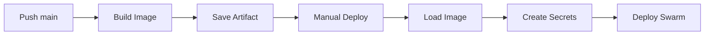

# PPHOOK Docker - Guide de déploiement

Version dockerisée de PPHOOK pour déploiement sur Docker Swarm avec GitLab CI/CD.

## 📁 Structure du dossier `/docker`

```
docker/
├── Dockerfile              # Image Docker PPHOOK
├── docker-compose.yml      # Configuration Swarm
├── config_loader.py        # Loader des Docker Secrets
├── hook_docker.py          # Version modifiée de hook.py
├── deploy.sh               # Script de déploiement
├── .gitlab-ci.yml          # Pipeline GitLab CI/CD
└── README-Docker.md        # Ce guide
```

## 🚀 Déploiement

### Option A : Mode Manuel

```bash
cd docker/
./deploy.sh configure  # Configuration interactive
./deploy.sh build     # Construction image
./deploy.sh deploy    # Déploiement complet
```

### Option B : Mode CI/CD GitLab

1. **Configurer les variables GitLab** (Settings > CI/CD > Variables) :

#### Variables de connexion Docker Swarm
- `SWARM_MANAGER_IP` : IP du manager Swarm
- `DOCKER_CERT` : Certificat client (base64)
- `DOCKER_KEY` : Clé privée client (base64)  
- `DOCKER_CA` : Certificat CA (base64)

#### Variables de configuration PPHOOK
- `PHPIPAM_URL` : URL API phpIPAM
- `PHPIPAM_APP_ID` : ID application phpIPAM
- `PHPIPAM_USERNAME` : Utilisateur phpIPAM
- `PHPIPAM_PASSWORD` : Mot de passe phpIPAM
- `POWERDNS_URL` : URL API PowerDNS
- `POWERDNS_API_KEY` : Clé API PowerDNS
- `SMTP_SERVER` : Serveur SMTP
- `SMTP_PORT` : Port SMTP
- `EMAIL_FROM` : Email expéditeur
- `EMAIL_TO` : Email destinataire
- `GENERIC_EMAIL` : Email générique (optionnel)
- `HOSTNAME_PATTERN` : Pattern validation hostname
- `MAX_HOSTNAME_LENGTH` : Longueur max hostname
- `CHECK_INTERVAL` : Intervalle vérification (secondes)

2. **Push sur la branche `main`** → déclenche le pipeline

3. **Déploiement manuel** dans l'interface GitLab

## 🛠️ Gestion du service

### Commandes utiles

```bash
# Statut du déploiement
./deploy.sh status

# Logs en temps réel
./deploy.sh logs

# Reset timestamp
./deploy.sh reset

# Suppression complète
./deploy.sh cleanup
```

### Commandes Docker Swarm

```bash
# Services du stack
docker stack services pphook

# Logs du service
docker service logs -f pphook_pphook

# Mise à l'échelle (si besoin)
docker service scale pphook_pphook=2

# Mise à jour rolling
docker service update --image pphook:1.0 pphook_pphook
```

## 🔐 Gestion des secrets

### Secrets Docker créés automatiquement
- `phpipam_url`, `phpipam_app_id`, `phpipam_username`, `phpipam_password`
- `powerdns_url`, `powerdns_api_key`
- `smtp_server`, `smtp_port`, `email_from`, `email_to`, `generic_email`
- `hostname_pattern`, `max_hostname_length`, `check_interval`

### Gestion manuelle des secrets

```bash
# Lister les secrets
docker secret ls

# Créer un secret
echo "nouvelle_valeur" | docker secret create nom_secret -

# Supprimer un secret (nécessite arrêt du service)
docker secret rm nom_secret
```

## 📊 Monitoring

### Healthcheck
- **Intervalle** : 60 secondes
- **Timeout** : 10 secondes  
- **Vérification** : Existence du fichier `/var/lib/pphook/last_check`

### Logs
- **Container** : `/var/log/pphook.log`
- **Docker** : `docker service logs pphook_pphook`
- **Niveau** : INFO par défaut

### Volumes persistants
- `pphook_data` : `/var/lib/pphook` (timestamp, état)
- `pphook_logs` : `/var/log` (logs applicatifs)

## 🔄 Workflow GitLab CI/CD



## 🐛 Troubleshooting

### Problèmes fréquents

**Service ne démarre pas**
```bash
docker service logs pphook_pphook
# Vérifier les secrets et la configuration
```

**Connexion aux APIs échoue**
```bash
# Tester depuis le conteneur
docker exec $(docker ps -q -f name=pphook) curl -s http://phpipam-url/api
```

**Secrets manquants**
```bash
docker secret ls
# Recréer les secrets manquants
./deploy.sh configure
```

### Reset complet

```bash
./deploy.sh cleanup
docker secret ls | grep -E "phpipam|powerdns|smtp|email|hostname|check" | awk '{print $1}' | xargs docker secret rm
./deploy.sh deploy
```

## ⚙️ Configuration avancée

### Limites de ressources (docker-compose.yml)
```yaml
deploy:
  resources:
    limits:
      memory: 512M
      cpus: '0.5'
```

### Réseau personnalisé
```yaml
networks:
  pphook_network:
    driver: overlay
    attachable: true
```

### Placement des conteneurs
```yaml
deploy:
  placement:
    constraints:
      - node.role == manager
```

## 🔗 Liens utiles

- [Documentation Docker Swarm](https://docs.docker.com/engine/swarm/)
- [GitLab CI/CD Variables](https://docs.gitlab.com/ee/ci/variables/)
- [Docker Secrets](https://docs.docker.com/engine/swarm/secrets/)

---

**Support** : Voir le README principal du projet pour plus d'informations.
